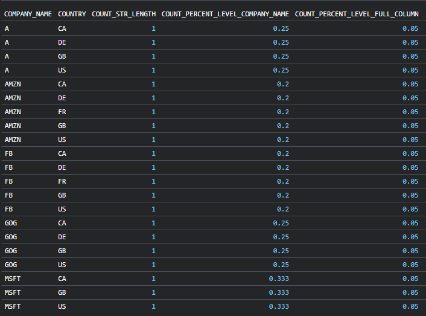
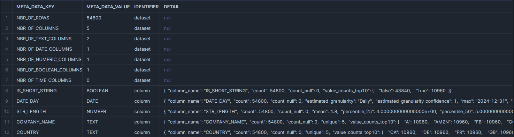

<p align="center">
  
</p>

<p align="center">
    
    
    
    
</p>

<p align="center">
    
    
    
    
</p>

# dbt_eda_tools
## A medley of macros that could be handy for your Exploratory Data Analysis in DBT.

✅ **Get Missing Dates**
`Finds all the missing dates in a model for the specified dimensions and filters according to the time granularity expected`

✅ **Show as Percentage**
`Shows the value as percentage of the total value for the specified aggregations`

✅ **Exploratory data analysis**

> ✅ **describe()**
`Returns metadata on the model, including the number of rows, the number of columns, and the number of columns by data type (numeric, text, date...).`

> ✅ **Categoric column exploration**
`Get summary statistics such as Count, Unique values, Null values for categoric columns`

> ✅ **Numeric column exploration**
`Get summary statistics such as Min, Max, Median, Null values, Percentiles etc. for numeric columns`

> ✅ **Timeseries column exploration**
`Get summary statistics such as Start date, End date, estimated granularity of the timeseries (day,month,year), null values for timeseries columns`

✅ **Debug Preview during dbt build/run**

> ✅ **Get row count**
`Logs the row count for both tables & views in the termialn after dbt build/run`

> ✅ **Get preview of the model**
`Preview of the model in the terminal during dbt build/run`


| DB | Status |
| ------ | ------ |
| Snowflake| ✅ |
| Bigquery | ✅ |
| Duckdb  (default) | ✅ |

# 💾 Install

Include in `packages.yml`

```yaml
packages:
  - package: shankararul/dbt_eda_tools
    version: ">=1.3.0"
```
[Read the docs](https://docs.getdbt.com/docs/package-management) for more information on installing packages.

[Latest Release](https://github.com/shankararul/dbt_eda_tools/releases) of dbt_eda_tools


# 🔨 Examples

### Get Missing Dates

```sh
get_missing_date('model_name', date_col, dimensions, filters, expected_frequency)
```

### [Example 1](examples/public/get_missing_dates/get_missing_dates_ex1.sql)
> ➡️ Input
```sh
{{dbt_eda_tools.get_missing_date('missing_day','date_day', [], {}, 'DAY')}}
```

> ⬅️ Output


> 👓 Explanation
 ```
 Finds all the missing dates For the date_day column in the missing_day model with the expected_frequency set to DAY across all dimensions without any filters

 Returns 1 row with the missing dates
 ```

### [Example 2](examples/public/get_missing_dates/get_missing_dates_ex2.sql)
> ➡️ Input
```sh
{{dbt_eda_tools.get_missing_date('missing_month','date_month', ['country'], {}, 'MONTH')}}
```

> ⬅️ Output


> 👓 Explanation
 ```
 Finds all the missing dates For the `date_month` column in the `missing_month` model with the `expected_frequency` set to `MONTH` for each of the countries without any filters.
 Returns 6 rows with the missing dates
 ```

### [Example 3](examples/public/get_missing_dates/get_missing_dates_ex3.sql)

> ➡️ Input
```sh
{{
    dbt_eda_tools.get_missing_date(
        'missing_day'
        ,'date_day'
        , ['country','company_name']
        , {
            'country': ('DE','US')
            , 'company_name': 'MSFT'
            , 'str_length': '>2'
        }
        , 'DAY'
    )
}}
```

> ⬅️ Output


> 👓 Explanation
```
 Finds all the missing dates For the `date_day` column in the `missing_day` model with the `expected_frequency` set to `DAY` for each of the countries and companies with the country as `DE` or `US` and the company name as `MSFT` and the string length greater than 2.

 Returns 3 rows with the missing dates
 ```

💁 Note: You can send in numeric comparison operators as filters as well within quotes ['=3'](examples/public/get_missing_dates_ex4.sql) or '!=3'

### Show as Percent of total

```sh
percent_of_total(column_to_aggregate, aggregation=None,precision=None,level=None)
```

### [Example 1](examples/public/percent_of_total/percent_of_total_ex1.sql)
> ➡️ Input
```sh
SELECT
    country
    -- example: sum
    , SUM(str_length) AS sum_2_str_length
    , {{dbt_eda_tools.percent_of_total('str_length','sum',3)}} AS sum_percent

    -- example: count
    , COUNT(company_name) AS count_company_name
    -- defaults to count if no aggregation function is specified and 2 decimals if no precision is specified
    , {{dbt_eda_tools.percent_of_total('company_name', precision=3)}} AS count_percent

FROM ref('data_aggregated')
GROUP BY 1
```

> ⬅️ Output


> 👓 Explanation
 ```
 The `sum_percent` column is the percentage of the total sum of the str_length column for each country. The `count_percent` column is the percentage of the total count of the company_name column for each country.
 ```

### [Example 2](examples/public/percent_of_total/percent_of_total_ex2.sql)
> ➡️ Input
```sh
SELECT
    company_name
    , country
    , count(str_length) AS count_str_length
    -- the percentages are caclulated at the aggregation of company_name and not entire column
    , {{dbt_eda_tools.percent_of_total('str_length','count',3, ['company_name'])}} AS count_percent

FROM {{ ref('data_aggregated') }}
GROUP BY 1,2
```

> ⬅️ Output


> 👓 Explanation
 ```
 The percentages are calculated at the level of company_name and not the entire column. Hence the percentages of MSFT sum to 1 and GOG sum to 1.
 ```

### Describe

```sh
describe('model_name', include=None)

 Include can take an array ['text','boolean','numeric','date'] or a single string 'all'. If none is provided, returns meta data on the entire dataset.
```

### [Example 1](examples/public/describe/describe_ex1.sql)
> ➡️ Input
```sh
{{dbt_eda_tools.describe('data_generator_enriched_describe')}}
```

> ⬅️ Output


> 👓 Explanation
 ```
 This macro returns a table with the number of rows, columns, date columns, text columns, numeric columns, boolean columns and time columns in the input model. The output loosely and closely intends to replicate the behavior of pd.describe() in pandas.
 ```

### [Example 2](examples/public/describe/describe_ex4.sql)
> ➡️ Input
```sh
{{dbt_eda_tools.describe('data_generator_enriched_describe', include='all')}}
```

> ⬅️ Output


> 👓 Explanation
 ```
 Filters only for column meta data and unpivots the JSON dict to be more readable.
 Keys include: 'count','count_null',PERCENT_NULL,'column_name','estimated_granularity','estimated_granularity_confidence','max','mean','min','percentile_25','percentile_50','percentile_75','unique','value_counts_top10'
 ```

 ### [Example 3](examples/public/describe/describe_ex5.sql)
> ➡️ Input
```sh
{{dbt_eda_tools.describe('data_generator_enriched_describe', include=['text','boolean','numeric'])}}
```

> 👓 Explanation
 ```
 Filters the column metadata for the types provided. In this case, text, boolean and numeric columns are returned.
 ```

## Debug/Preview in the terminal

```sh
dbt_project.yml
----------------
...
...
vars:
  dbt_eda_tools_log_enable: true

```

```
Add the dbt_eda_tools_log_enable variable to your dbt_project.yml and set it to true. This will enable logging of the row count and preview for each model.
```

### Get Row count

```sh
dbt_project.yml
----------------
...
...
models:
  +post-hook:
      - "{{ dbt_eda_tools.get_row_count() }}"
```

> 👓 Explanation
 ```
 Returns the number of rows in the model. This is useful for debugging and previewing the output of a model in the terminal.

 💡 Tip: You can add this to the post-hook of any model to get the number of rows in the model after it is run. This is useful for debugging and previewing the output of a model in the terminal.

 ```

> ⬅️ Output


### Get Head / Preview of the model

```sh
dbt_project.yml
----------------
...
...
models:
  +post-hook:
      - "{{ dbt_eda_tools.get_preview(10) }}"
```

> 👓 Explanation
 ```
 Returns the top N number of rows in the model. Defaults to 5 if not specified. This is useful for debugging and previewing the model in the terminal.

 💡 Tip: You can add this to the post-hook of any model to get the preview ofthe model after it is run. This is useful for debugging and previewing the output of a model in the terminal.

 ```

> ⬅️ Output


# 🔧 Contribution
If you'd like to contribute, please do open a Pull Request or an Issue. Feel free to [reach out to me](https://linkedin.com/in/shankararul) should you have any questions.
